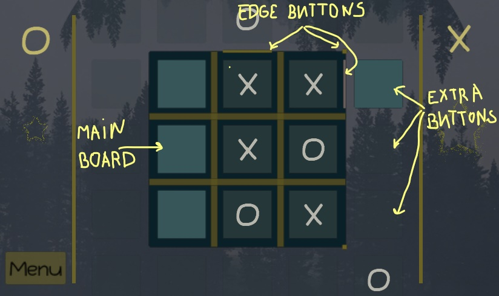
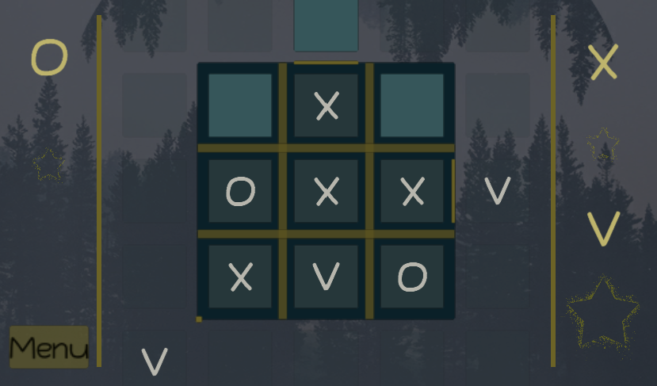
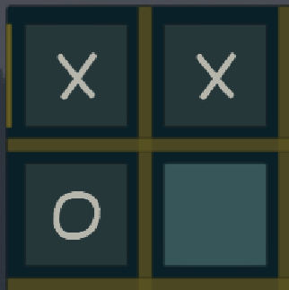
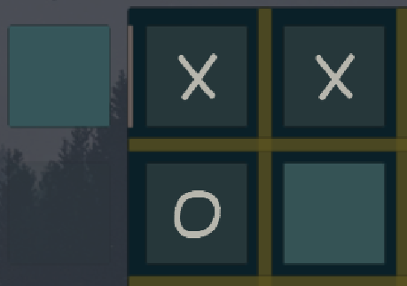

# TicTacToeExtended

Tic Tac Toe Extended has the same set of rules as an original game except the player can enabled extra spaces. Hence it has the main board which includes 9 spaces (buttons) and 16 extra spaces (buttons) and 16 edge buttons. The player can enable an extra space by pressing one of the edge buttons.

The game is available for 2 or 3 players.

 

## Rules

- if the player has two buttons pressed next to each other - an edge button appears

- from now on each player has a choice to press an edge button and create an extra field or occupies a space on the original board 
- REMEMBER: one player can NOT press an edge button and  space on the board at the same time

- and like usually the player wins when three spaces are pressed in a row (vertically, horizontally or diagonally)

## Play

Tic Tac Toe extended is available on:

https://simmer.io/@AnyaKarpiuk/tic-tac-toe-extended
